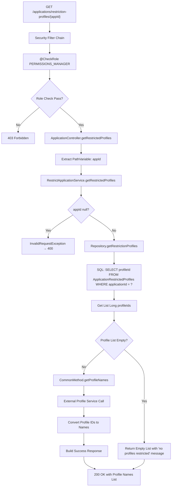
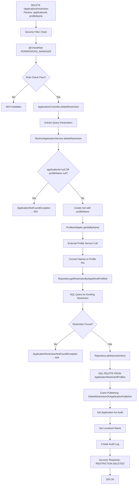
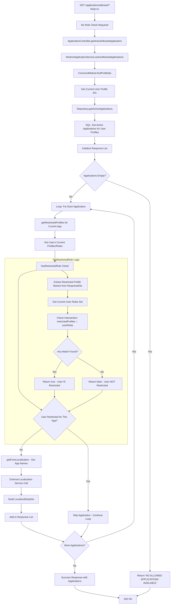

# Application Management API Comprehensive Flows

## PUT /api/secured/v1/applications/restriction (Updated to Match Current Implementation)

```mermaid
flowchart TD
    A["HTTP PUT Request: /applications/restriction<br/>Headers: Authorization Bearer Token<br/>Body: RestrictionRequestDto"] --> B["Spring Security Filter Chain"]
    B --> B1["JWT Token Validation"]
    B1 --> B2{"Token Valid?"}
    B2 -->|No| B3["Return 401 Unauthorized"]
    B2 -->|Yes| C["RoleCheckAspect @Before Intercept"]
    
    C --> C1["Extract JWT Authorities"]
    C1 --> C2["Convert Authorities to Lowercase Set"]
    C2 --> C3["Required Roles: permissions-manager"]
    C3 --> D{"User Has PERMISSIONS_MANAGER Role?"}
    
    D -->|No| E["Create Event Log Entry"]
    E --> E1["Log: User Access Denied with Required/Provided Roles"]
    E1 --> F["Throw AccessDeniedException<br/>Message: Access Denied Required roles vs Provided roles"]
    F --> F1["Return 403 Forbidden"]
    
    D -->|Yes| G["Spring MVC Request Binding"]
    G --> G1["Deserialize JSON Body to RestrictionRequestDto"]
    G1 --> H{"Request Body Valid?"}
    H -->|No| I["Bean Validation Errors"]
    I --> I1["Return 400 Bad Request with Validation Details"]
    
    H -->|Yes| J["ApplicationController.addRestriction"]
    J --> J1["Log: START addRestriction with application_id"]
    J1 --> K["RestrictApplicationService.addRestriction"]
    
    K --> K1["Performance Timer Start: startMain"]
    K1 --> L["Input Validation Check"]
    L --> M{"requestDto null OR application_id null OR profiles null?"}
    
    M -->|Yes| N["Throw ApplicationNotFoundException"]
    N --> N1["Exception Handler: @ExceptionHandler"]
    N1 --> O["Return 404 Not Found<br/>Message: application not found"]
    
    M -->|No| P["Extract Profile Names Processing"]
    P --> P1["Initialize HashSet groupNames"]
    P1 --> P2["Loop: For Each ProfileName in requestDto.getProfiles"]
    P2 --> P3["Add ProfileName.getName to groupNames Set"]
    P3 --> P4{"More Profiles to Process?"}
    P4 -->|Yes| P2
    P4 -->|No| Q["ProfilesAdapter.findOrAddProfile Call"]
    
    Q --> Q1["Performance Timer: Start findOrAddProfile"]
    Q1 --> Q2["External Service Call to Profile Management"]
    Q2 --> Q3["Return List ProfileResponseRecord"]
    Q3 --> Q4["Performance Timer: End findOrAddProfile - Log Time"]
    Q4 --> R["Convert ProfileResponseRecord to Profile IDs"]
    
    R --> R1["Initialize ArrayList ids"]
    R1 --> R2["Loop: Extract id from Each ProfileResponseRecord"]
    R2 --> R3["Add Profile ID to ids List"]
    R3 --> R4{"More Records to Process?"}
    R4 -->|Yes| R2
    R4 -->|No| R5["Log: profile ids List"]
    
    R5 --> S["Check Existing Restrictions"]
    S --> S1["Performance Timer: Start getRestrictionByAppIdAndProfileId"]
    S1 --> T["ApplicationsRestrictedProfilesRepository.getRestrictionByAppIdAndProfileId"]
    T --> T1["JPA Query Execution:<br/>SELECT a FROM ApplicationRestrictedProfiles a<br/>JOIN Applications ap ON ap.id=a.applicationId<br/>WHERE a.applicationId=:id AND a.profileId IN :profileIds"]
    T1 --> T2["Database Query with Indexed Lookup"]
    T2 --> T3["Return ApplicationRestrictedProfiles or null"]
    T3 --> T4["Performance Timer: End getRestrictionByAppIdAndProfileId - Log Time"]
    
    T4 --> U{"Restriction Already Exists?"}
    U -->|Yes| V["Throw ApplicationRestrictionException"]
    V --> V1["Exception Message: Restriction already exist for profile + profileId"]
    V1 --> W["Return 409 Conflict<br/>Body: Restriction already exists"]
    
    U -->|No| X["Start Profile Loop Processing"]
    X --> X1["Loop: For Each Profile ID in ids List"]
    X1 --> Y["Create New ApplicationRestrictedProfiles Entity"]
    Y --> Y1["Set applicationId from requestDto"]
    Y1 --> Y2["Set profileId from current iteration"]
    
    Y2 --> Z["Save to Database"]
    Z --> Z1["Performance Timer: Start save restriction"]
    Z1 --> AA["ApplicationsRestrictedProfilesRepository.save"]
    AA --> AA1["JPA EntityManager.persist"]
    AA1 --> AA2["Database INSERT with Transaction"]
    AA2 --> AA3["Performance Timer: End save restriction - Log Time"]
    
    AA3 --> BB["Event Publishing"]
    BB --> BB1["Create EventRequestRecord"]
    BB1 --> BB2["Set applicationId, profileId as String"]
    BB2 --> CC["AddRestrictionOnApplicationPublisher.addRestriction"]
    CC --> CC1["Spring ApplicationEventPublisher"]
    CC1 --> CC2["Asynchronous Event Processing"]
    
    CC2 --> DD["Get Application for Audit"]
    DD --> DD1["Performance Timer: Start getApplicationById"]
    DD1 --> EE["ApplicationsRepository.getApplicationById"]
    EE --> EE1["JPA findById Query"]
    EE1 --> EE2["Performance Timer: End getApplicationById - Log Time"]
    
    EE2 --> FF["Get Application Localized Name"]
    FF --> FF1["getFromLocalization Call with 'en' language"]
    FF1 --> FF2["CommonMethod.getFluxData"]
    FF2 --> FF3["WebClient Call to Localization Service"]
    FF3 --> FF4["Return KeyListDto with Localized Names"]
    FF4 --> FF5["Extract English Name for Audit"]
    FF5 --> FF6["Filter by languageCode = 'en'"]
    FF6 --> FF7["Convert to Lowercase for entityName"]
    
    FF7 --> GG["Prepare Audit Data"]
    GG --> GG1["CommonMethod.convertObjectToJson"]
    GG1 --> GG2["Serialize RestrictionRequestDto to JSON"]
    GG2 --> GG3["Log Request JSON for Debug"]
    
    GG3 --> HH["Create Audit Log Entry"]
    HH --> HH1["AddEventLogService.insertEventData"]
    HH1 --> HH2["Parameters: moduleId=1, entityName, httpServletRequest"]
    HH2 --> HH3["Action Description: Developer + username + restrict Application id + for user + groupNames"]
    HH3 --> HH4["Store Request JSON and Response"]
    HH4 --> HH5["Insert Audit Record to Database"]
    
    HH5 --> II{"More Profile IDs to Process?"}
    II -->|Yes| X1
    II -->|No| JJ["Prepare Success Response"]
    
    JJ --> JJ1["Set ResponseDto.data = 'DONE..'"]
    JJ1 --> JJ2["Set ResponseDto.message = 'RESTRICTION DONE'"]
    JJ2 --> JJ3["Set ResponseDto.status = HttpStatus.OK"]
    JJ3 --> JJ4["Performance Timer: End Main - Log Total Time"]
    
    JJ4 --> KK["Return to Controller"]
    KK --> KK1["Log: END addRestriction"]
    KK1 --> LL["Create ResponseEntity"]
    LL --> LL1["Set HTTP Status from ResponseDto"]
    LL1 --> MM["HTTP 200 OK Response"]
    MM --> MM1["JSON Response Body:<br/>{data: 'DONE..', message: 'RESTRICTION DONE', status: 'OK'}"]

    %% Styling
    classDef errorClass fill:#ffcccc,stroke:#ff0000,stroke-width:2px
    classDef successClass fill:#ccffcc,stroke:#00ff00,stroke-width:2px
    classDef processClass fill:#cceeff,stroke:#0066cc,stroke-width:2px
    classDef dbClass fill:#ffffcc,stroke:#ffcc00,stroke-width:2px
    classDef loopClass fill:#e6ccff,stroke:#9933cc,stroke-width:2px
    
    class F1,I1,O,W errorClass
    class MM1 successClass
    class K,Q,T,AA,CC,HH processClass
    class T1,T2,AA1,AA2,EE1,HH5 dbClass
    class X1,II loopClass
```

## GET /api/secured/v1/applications/restriction-profiles/{appId}

## DELETE /api/secured/v1/applications/restriction

## GET /api/secured/v1/applications/allowed

